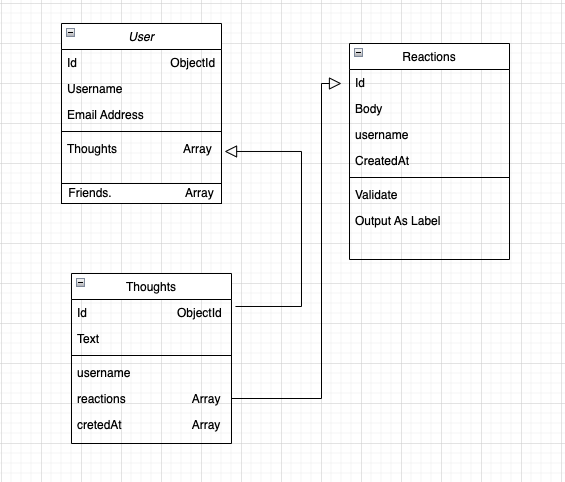
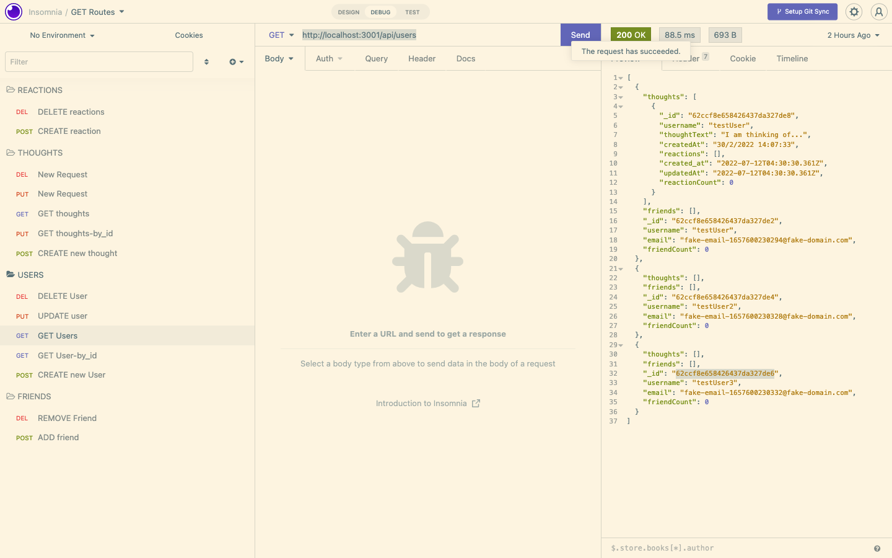
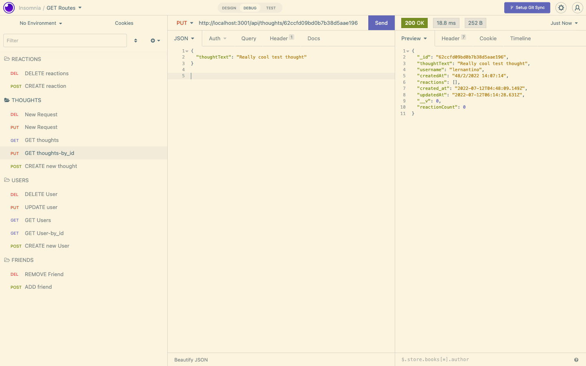

# Social-API
A social API with MongoDB and Mongoose ODM
By Raj Nori

## Table of contents
* [General Info](#general-information)  
* [Technologies Used](#technologies-used)  
* [Schema](#schema)
* [Features](#features)  
* [Screenshots](#screenshots)  
* [Video](#video)  
* [Setup](#setup)  
* [Usage](#usage)  
* [Project Status](#project-status)  
* [Room for improvement](#room-for-improvement)  
* [Acknowledgement](#acknowledgement)  
* [Contact](#contact)  

## General Information   

> **MongoDB** is a popular choice for many social networks due to its speed with large amounts of data and flexibility with unstructured data. Over the last part of this course, you’ll use several of the technologies that social networking platforms use in their *full-stack applications*. Because the foundation of these applications is data, it’s important that you understand how to build and structure the API first.   

Your Challenge is to build an API for a social network web application where users can share their thoughts, react to friends’ thoughts, and create a friend list. You’ll use Express.js for routing, a *MongoDB database*, and the *Mongoose ODM*. In addition to using the *Express.js* and *Mongoose* packages, you may also optionally use a *JavaScript date library* of your choice or the native JavaScript Date object to format timestamps.   

No seed data is provided, so you’ll need to create your own data using *Insomnia* after you’ve created your API.  

Because this application won’t be deployed, you’ll also need to create a walkthrough video that demonstrates its functionality and all of the following acceptance criteria being met. You’ll need to submit a link to the video and add it to the README of your project.  

## User Story
- AS A social media startup I WANT an API for my social network that uses a NoSQL database SO THAT my website can handle large amounts of unstructured data  

## Acceptance Criteria
> GIVEN a social network *API*
WHEN I enter the command to invoke the application   
> THEN my server is started and the *Mongoose models* are synced to the *MongoDB database*
> WHEN I open API GET routes in *Insomnia* for users and thoughts
THEN the data for each of these routes is displayed in a formatted JSON   
> WHEN I test API POST, PUT, and DELETE routes in Insomnia
THEN I am able to successfully create, update, and delete users and thoughts in my database  
> WHEN I test API POST and DELETE routes in Insomnia
THEN I am able to successfully create and delete reactions to thoughts and add and remove friends to a user’s friend list

# Technologies used
- JavaScript 
- Node.js 
- Express.js
- MongoDB 
- Mongoose
 
# Features
- A social Network *API* where the user can 
   - Share thoughts
   - React to friends thoughts
   - Create a friends list
   - & Format Timestamps
# Database Schema

# Screenshots

# video walkthrough

[part-1](./media/video/Part1.mp4)
[part-2](./media/video/Part2.mp4)
[part-3](./media/video/Part3.mp4)

> [youtube](https://youtu.be/mZUmA2XWqYU)
# Setup

> Download the code as a Zip file or clone the repo and run it on your local machine. 
>Type npm start 

# usage
Can be used to test API end points for a social media project.

# Project Status

> Complete

# Room for improvement
> Can add a Front-end to make it a Full stack MERN application.
# Acknowledgements

> I would like to thank the team at Monash bootcamps, PluralSight and Coding Addict. [JohnSmilga](https://www.youtube.com/c/CodingAddict)

# contact
> Created by [@rajnori](https://rajnori.github.io/Portfolio-project/) - feel free to contact me by clicking on the link [here](https://rajnori.github.io/Portfolio-project/)!